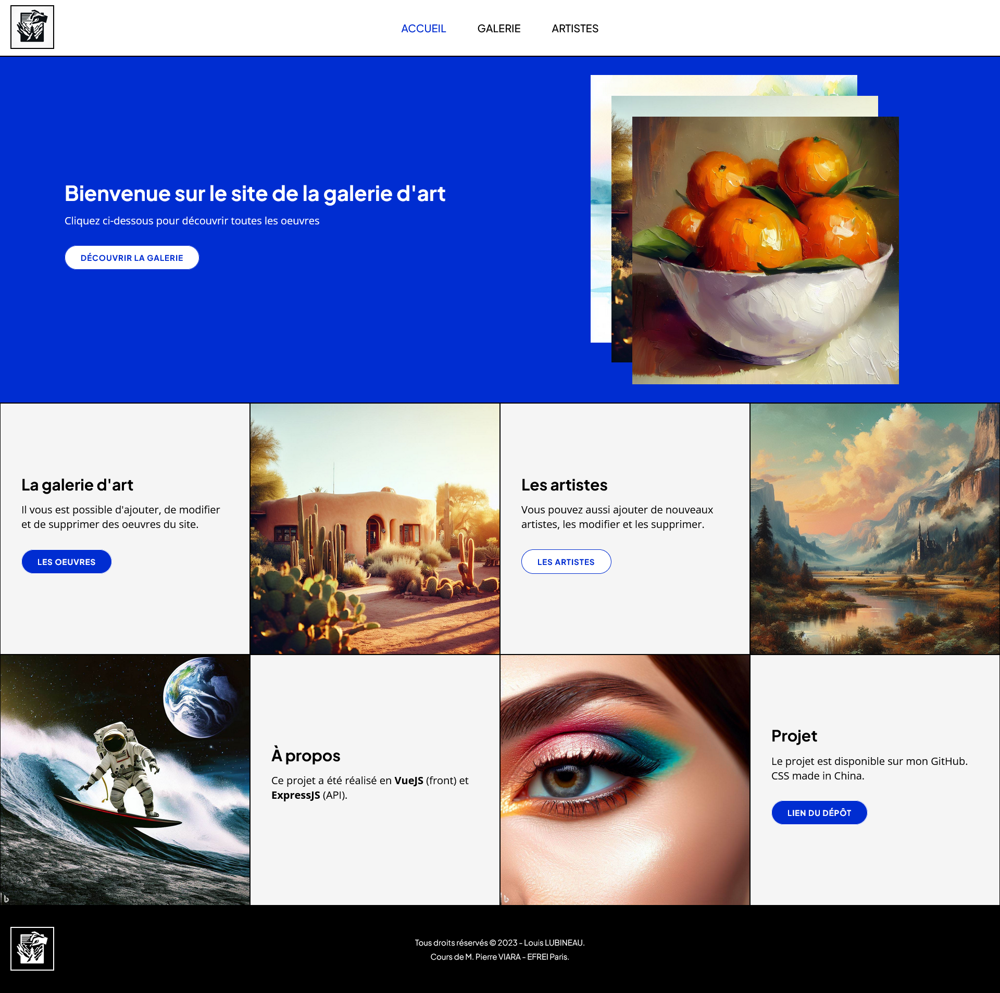
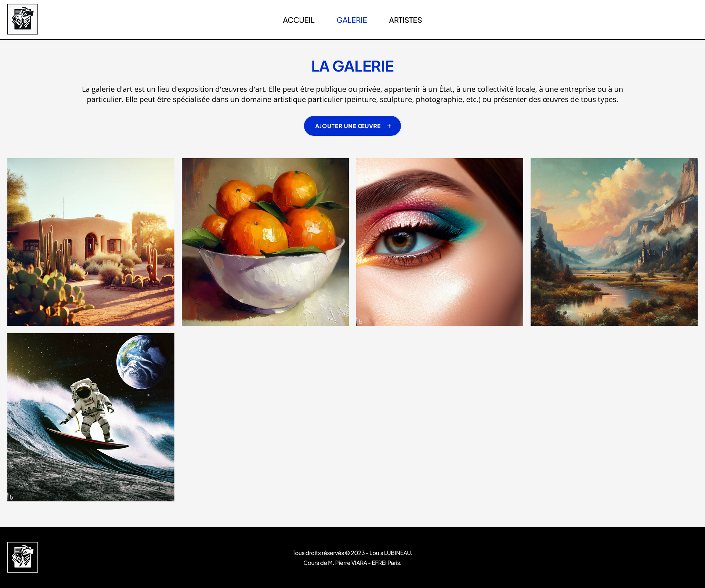
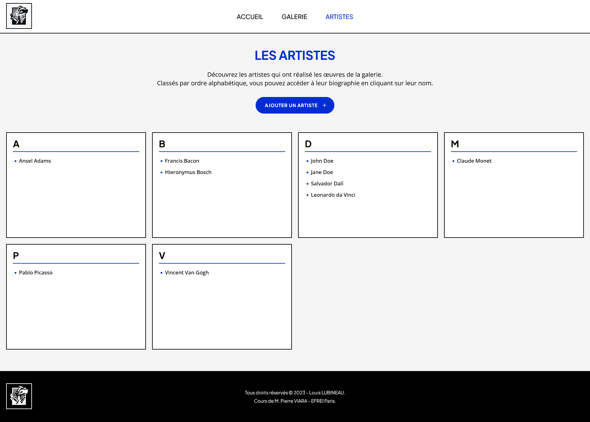

# Projet en Vue.js et Express.js
## Description
- ⚠️ **En cours de réalisation** ⚠️
- Projet de création d'un site web en Vue.js et Express.js, création d'une galerie d'art répertoriant différents types œuvres ainsi que différents artistes. (fictif)

## Installation
Le projet est en deux segments, une partie front réalisé en VueJS et une partie back (API) réalisé en ExpressJS.

Dans un premier temps : 
- Cloner le projet

### Partie Back (API)
- Se rendre dans le dossier `express-api`
- Installer les dépendances :
```bash
npm install
```
- Lancer le serveur :
```bash
npm run start
```

### Partie Front
- Se rendre dans le dossier `vue-front`
- Installer les dépendances :
```bash
npm install
```
- Lancer le serveur :
```bash
npm run preview
```

## Aperçu






